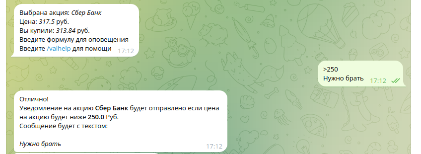

# Тг бот для помощи в инвестициях

## Возможности
* Анализ своих акций ❌
* Настройка уведомлений о цене ✅

## Запуск
Перед любым из запусков необходимо в папке `settings`  сделать копию файла `.env.template`
`.env` и задать все переменные среды
### docker-compose
для запуска в докере нужно прописать
```bash
docker-compose up -d
```
### В ручную
Установить зависимости
```bash
poetry install
```
Запустить `mongo` и `redis`.

Запустить бота 
```bash 
python run_bot.py
```
И запустить парсер валют
```bash
python manage_app.py find-instrument
```

После можно будет запустить и сам скрипт обвновления цен
```bash
python manage_app.py
```


## Использование
### Работа с уведомлениями

Уравнение цены задается следующим образом:

```
<|> condition
comment_text
```
* `<|>` -- знак для сравнения акции. `<` -- уведомление будет если цена акции будет ниже вычисленной цены. `>` -- 
если выше соответственно
* `condition` -- формула для вычисления цены. Может задаваться выражением содержащим *,/,+,-,cur,c,me,m
  * `cur|c` -- означает текущую цену акции
  * `me|m` -- цену по которой вами акция покупалась
* `comment_text` -- текст, который придет вместе с уведомлением
